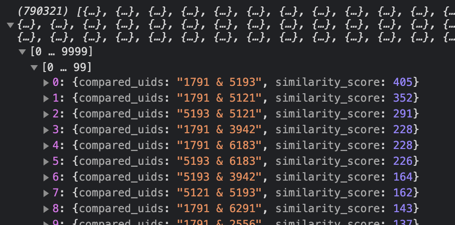
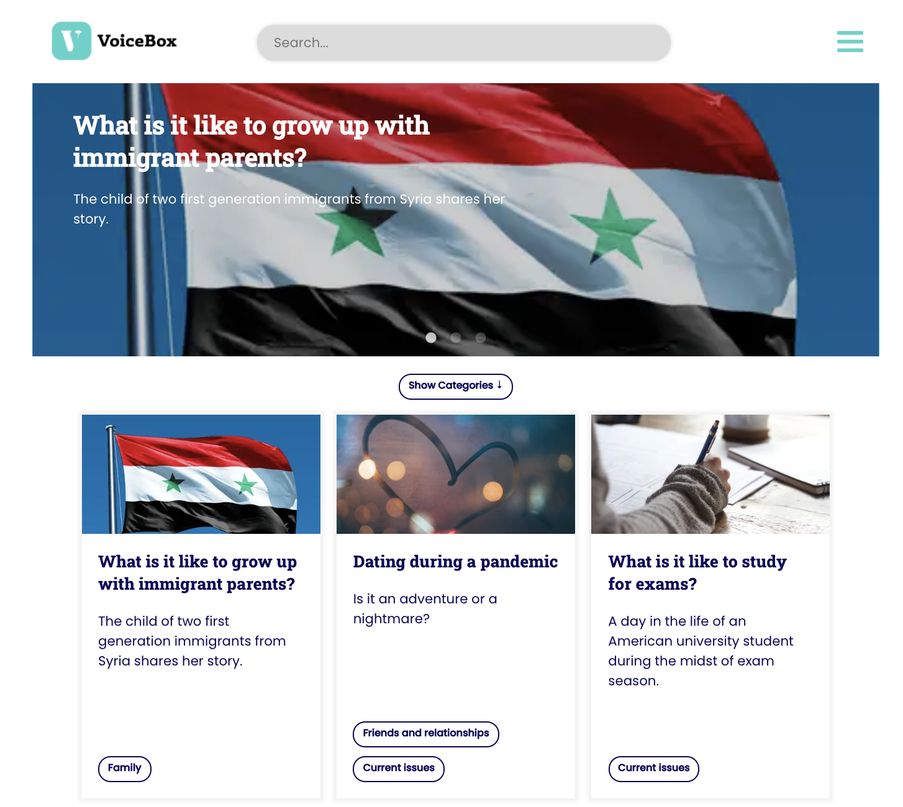

# Otta - Engineering Interview Task

This is the take-home interview task for engineering job applications at Otta.

The goal is to both give you a flavour of the kind of work we do, and give us an idea of your technical (and non-technical) skills. The key thing we're assessing is your level of pragmatism, but we're also interested in code style and how you structure the problem (so please don't just do it in SQL!)

We expect the task to take one hour. If you require clarification on anything, please don't hesitate to contact us.

## Instructions

Start by cloning this repository using your personal GitHub account. Create a new private repository and push your clone to this new repo (you will need to remove the original remote with `git remote remove origin`). Please ensure all of your work is committed to this - we'll only consider the `main` branch.

The following details the individual tasks. Please complete **all** of the them. You may **use any programming language**, provided all of the code used can be committed to this repo. You don't need to provide instructions for running the code, or any explanation other than the answers.

### Task 1

In the `data` folder of this repo there is a CSV file called `reactions.csv`. It contains real data corresponding to how users on Otta have reacted to (saved or skipped) jobs on the platform.

The reaction data consists of four columns:

- `user_id` - the integer ID of the user who liked or disliked the job
- `job_id` - the integer ID of the job the user interacted with
- `direction` - whether the user liked (`true`) or disliked (`false`) the job
- `time` - the timestamp corresponding to when they reacted to the job

**Task**: The similarity score between two users is the number of jobs which they both like. Find the two users with the highest similarity.

**Answer**: **1791 & 5193 with a similarity score of 405**

### Task 2

In the `data` folder there is an additional CSV file called `jobs.csv`. It contains unique integer IDs for over 12,000 jobs, along with integer IDs for the job's associated company.

**Task**: The similarity score between two companies is the number of users who like at least one job at both companies. Using both the `reactions.csv` and `jobs.csv` data, find the two companies with the highest similarity score.

**Answer**: 60 & 35 with a similarity score of 17

### Task 3

Engineering at Otta is truly full-stack. Features are owned end-to-end, from backend and database-level work to front-end finishes.

We don't think it's fair to ask you to build something with a UI, as we know this can take a while and time is precious. Instead, we'd love to see an example of something you've already built and hear about what you learned building it.

**Task**: Share an example of something you've built using front-end web technologies.

- A link to a GitHub repo is ideal
- If the best example of your work is something you've done at a company, it's okay to link to a live deployed version
- If you can't link to anything, a screenshot is also fine

**Answer**: [VoiceBox](https://voicebox.site/)

**Task**: Tell us about the biggest challenge you faced in building the above.

**Answer**: The above was developed using Gatsby, React, GraphQL and NetlifyCMS, I took over the sole development of this product halfway before it was pushed live. I had to learn Graphql and the buggy nuances of NetlifyCMS pretty quickly, and did so in a short time span, went live on time, and I'm even growing to love the buggy nuances!

The only other challenge I would say was working with Netlify-CMS. Netlify CMS is pretty bare bones and beautiful, but it does have its downsides when it comes to visibility and configurability.

## Submission

Once you've completed all of the above tasks, make sure:

- [x] You've committed all of the code used, and your edited answers, to the `main` branch
- [x] You've pushed the changes to your repo
- [x] You add `XavKearney` and `shfranklin` as contributors for your personal repo, and send a link to the repo in an email or Otta message to us

Good luck!
